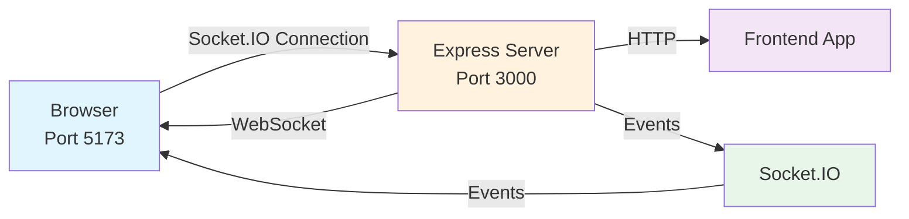
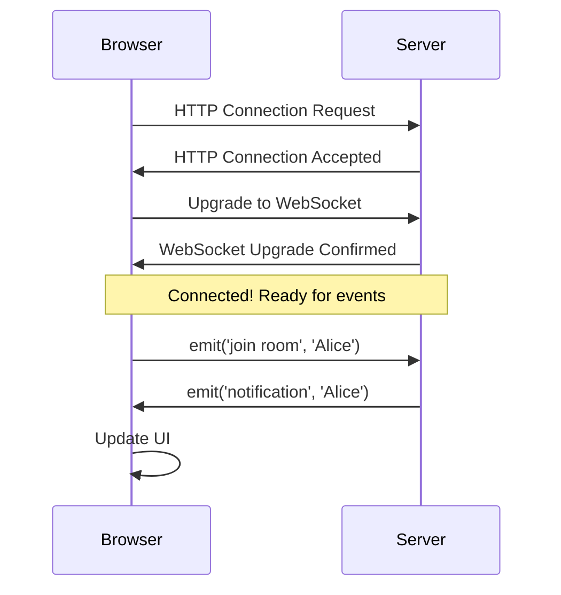
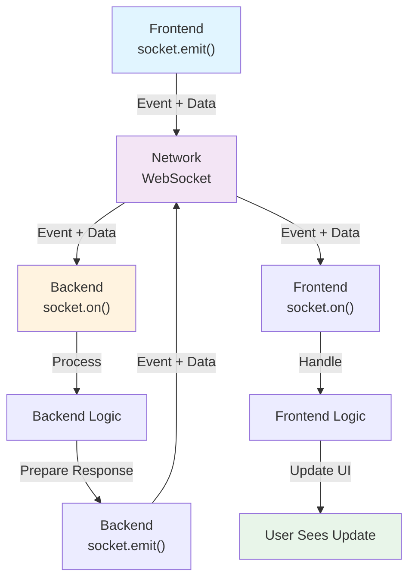
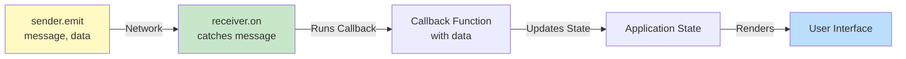
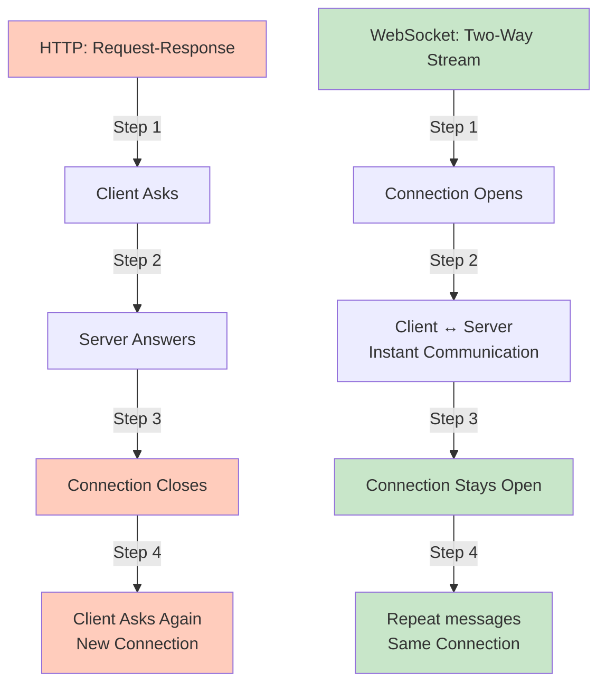
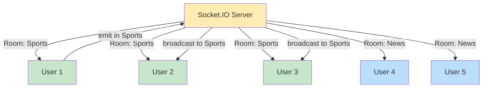

# Socket.IO Complete Beginner's Guide 🚀

## Introduction

Welcome! This guide will teach you everything about **Socket.IO** by explaining your real project step-by-step. Think of Socket.IO as magic that makes websites talk to each other instantly, just like WhatsApp or Telegram!

---

## Table of Contents

1. [Project Overview](#project-overview)
2. [Folder Structure](#folder-structure)
3. [How the Application Works](#how-the-application-works)
4. [Socket.IO Basics](#socketio-basics)
5. [HTTP Server and Express](#http-server-and-express)
6. [Frontend Explanation](#frontend-explanation)
7. [Backend Explanation](#backend-explanation)
8. [Event Flow Examples](#event-flow-examples)
9. [Connection Lifecycle](#connection-lifecycle)
10. [CORS Explanation](#cors-explanation)
11. [Common Errors](#common-errors)
12. [Mermaid Diagrams](#mermaid-diagrams)
13. [Real-Life Analogies](#real-life-analogies)
14. [Interview Questions and Answers](#interview-questions-and-answers)
15. [Hands-On Practice Tasks](#hands-on-practice-tasks)
16. [Advanced Concepts](#advanced-concepts)
17. [Cheat Sheet](#cheat-sheet)
18. [Key Takeaways](#key-takeaways)

---

## Project Overview

### What Is This Project?

Your project is a **real-time group chat application**. It's like WhatsApp, but on the web. Multiple people can join a chat room and send messages instantly. When one person joins, everyone in the room gets notified immediately!

### Why Socket.IO?

Normally, websites work like this:
- **You ask a question** → Server answers → Done
- Every time you want new information, you have to ask again

This is called **HTTP requests** (request-response model).

**Socket.IO solves this problem** by creating a permanent connection:
- **Two-way communication**: Frontend and Backend can talk to each other anytime, instantly
- **Real-time updates**: No need to refresh or ask again
- **Persistent connection**: Once connected, it stays connected until you close it

### Normal HTTP vs Real-Time Communication

#### Traditional HTTP (Like ordering food by phone)
```
You: "Is my food ready?" 📞
Restaurant: "No, it's still cooking"
(You wait and call again)
You: "Is my food ready?" 📞
Restaurant: "Yes! Come pick it up"
```
❌ You have to keep asking. Slow and annoying.

#### Socket.IO (Like a waiter checking on you)
```
You: "I want food" 🔔
Restaurant: Waiter stays with you → "Food is ready!" 🔔 (tells you automatically)
Restaurant: "Order is delivered!" 🔔 (tells you without you asking)
```
✅ The waiter automatically tells you when it's ready. Much better!

---

## Folder Structure

### Your Project Layout

```
SOCKET_PROJECT/
│
├── backend/                    # Server code (Node.js + Express)
│   ├── server.js              # Main server file - listens for connections
│   ├── package.json           # Dependencies (express, socket.io, cors)
│   └── node_modules/          # Libraries (don't touch this!)
│
├── frontend/                  # Client code (React + Vite)
│   ├── src/
│   │   ├── App.jsx            # Main React component - chat UI
│   │   ├── ws.js              # Socket.IO connection setup
│   │   ├── main.jsx           # Entry point (starts the React app)
│   │   └── index.css          # Styling
│   ├── package.json           # Dependencies (react, socket.io-client)
│   ├── vite.config.js         # Vite configuration
│   ├── index.html             # Main HTML file
│   └── node_modules/          # Libraries
```

### File Explanations

| File | Purpose |
|------|---------|
| **server.js** | Creates the HTTP server, handles Socket.IO connections, listens for events from clients |
| **ws.js** | Connects the frontend to the backend Socket.IO server |
| **App.jsx** | React component that shows the chat UI and handles user interactions |
| **main.jsx** | Starts the React application |
| **package.json** (backend) | Lists what libraries the backend needs |
| **package.json** (frontend) | Lists what libraries the frontend needs |

### What Each Folder Does

- **backend/** = The "kitchen" 👨‍🍳 (prepares and sends data)
- **frontend/** = The "restaurant lobby" 🏪 (where customers sit and see messages)

---

## How the Application Works

### The Big Picture Flow

```
1. User opens website → React App starts
   ↓
2. App connects to backend using Socket.IO
   ↓
3. User enters name and clicks "Continue"
   ↓
4. Frontend sends "join room" event to backend
   ↓
5. Backend adds user to group, sends "notification" to all users
   ↓
6. All users see notification: "John joined the room"
   ↓
7. User types message and clicks "Send"
   ↓
8. Message appears in user's chat (for now - no real backend sending yet)
```

### What Happens When User Joins

```
Frontend                          Backend
   │                                │
   ├─ emit('join room', name) ──────→ │
   │                                  ├─ socket.join(ROOM)
   │                                  ├─ io.to(ROOM).emit('notification', name)
   │ ← ─ ─ ─ ─ ─ on('notification')─ ┤
   ├─ Show notification            │
```

---

## Socket.IO Basics

### What Is Socket.IO?

Socket.IO is a **JavaScript library** that helps frontend and backend communicate instantly. It uses something called **WebSocket** under the hood (a special protocol for real-time communication).

### Core Concepts

#### 1. **io** - The Connection Object (Frontend)

**What it is:**
- `io` is a function that creates a connection to the backend server
- Think of it as dialing a phone number to connect to someone

**Example:**
```javascript
import { io } from "socket.io-client";  // Import the library

const socket = io('http://localhost:3000');  // Connect to server
// Now 'socket' is like a phone line connecting you to the backend
```

**Why?** Without `io`, the frontend has no way to talk to the backend in real-time.

---

#### 2. **socket** - Your Connection Line

**What it is:**
- Once you use `io()`, you get a `socket` object
- `socket` is YOUR personal connection to the server
- Each user has their own `socket`

**Example (Backend):**
```javascript
io.on("connection", (socket) => {
    console.log('User connected:', socket.id);
    // socket = this user's personal connection
});
```

**Example (Frontend):**
```javascript
const socket = io('http://localhost:3000');
// socket = my personal connection to backend
```

**Why?** Each user needs their own connection. Socket.IO automatically creates one for each user.

---

#### 3. **emit()** - Sending Messages

**What it is:**
- `emit()` means "send a message"
- It sends data from one place to another

**Syntax:**
```javascript
socket.emit('event_name', data);
```

**Example - Frontend sends message to backend:**
```javascript
// Frontend sends data to backend
socket.emit('join room', 'John');
// Translation: "Hey backend, event 'join room' happened, here's 'John'"
```

**Example - Backend sends message to frontend:**
```javascript
// Backend sends to a specific client
socket.emit('notification', 'Alice joined');
// Translation: "Hey frontend user, you received notification: Alice joined"
```

**Why?** `emit()` is like sending a text message. You send an event name and some data.

**What happens if you remove it?** Users can't send messages to the server. The app breaks.

---

#### 4. **on()** - Listening for Messages

**What it is:**
- `on()` means "wait and listen for this event"
- When someone `emit()`s, `on()` catches it

**Syntax:**
```javascript
socket.on('event_name', (data) => {
    // Do something when this event happens
});
```

**Example - Frontend listens for notifications:**
```javascript
socket.on('notification', (username) => {
    console.log(username + ' joined the room');
    // Show notification to user
});
```

**Example - Backend listens for join requests:**
```javascript
socket.on('join room', (name) => {
    console.log(name + ' joined the room');
    // Add user to room
});
```

**Why?** `on()` is like setting your phone to vibrate when you get a message. The event needs a listener.

**What happens if you remove it?** Messages are sent but nobody receives them.

---

#### 5. **emit() vs on()** - How They Work Together

Think of a two-way radio:
- **emit()** = Press button and speak
- **on()** = Listen for incoming message

```javascript
// Frontend
socket.emit('message', 'Hello server!');      // Speak
socket.on('response', (data) => {...});       // Listen

// Backend
socket.on('message', (data) => {              // Listen
    console.log('Got:', data);                 // "Hello server!"
});
socket.emit('response', 'Hello frontend!');   // Speak
```

---

#### 6. **broadcast** - Sending to Everyone EXCEPT You

**What it is:**
- When you do something, sometimes you want to tell everyone BUT yourself
- `broadcast` sends to everyone except the sender

**Example:**
```javascript
// Backend - when user joins
socket.broadcast.emit('notification', 'John joined!');
// Everyone gets this message EXCEPT John (the one who joined)
```

**Why?** If John joins, he already knows he joined. He doesn't need the notification. Only others need to know.

**Compare:**
```javascript
socket.emit('notification', 'msg');              // Send to THIS user only
io.emit('notification', 'msg');                  // Send to ALL users
socket.broadcast.emit('notification', 'msg');    // Send to ALL except this user
```

---

#### 7. **Rooms** - Grouping Users

**What it is:**
- A room is like a WhatsApp group
- You can put multiple sockets into one room
- Messages can be sent to everyone in a specific room

**Example:**
```javascript
// Backend - add user to room
socket.join('group');       // User joins room named 'group'

// Send message to everyone in that room
io.to('group').emit('message', 'Hello everyone!');
```

**Why?** Without rooms, you'd have to track all user IDs manually. Rooms do it automatically.

**Your project uses:**
```javascript
const ROOM = 'group';  // All users join the 'group' room

socket.on('join room', async (name) => {
    await socket.join(ROOM);  // Add this user to room
    io.to(ROOM).emit("notification", name);  // Tell everyone in room
});
```

---

#### 8. **Namespaces** - Creating Different Zones

**What it is:**
- Namespaces are like separate buildings within a mall
- `/` is the default namespace (main building)
- `/admin` could be an admin building
- Each namespace has its own connections, rooms, and events

**Example:**
```javascript
// Backend - create namespaces
const adminNamespace = io.of('/admin');
adminNamespace.on('connection', (socket) => {
    console.log('Admin connected');
});

// Frontend - connect to namespace
const adminSocket = io('http://localhost:3000/admin');
```

**Why?** When you have many types of users (admin, customer, moderator), you can separate them with namespaces.

**Your project:** Only uses the default namespace `/`

---

#### 9. **Acknowledgements** - Waiting for a Reply

**What it is:**
- Sometimes you want to know if the other person received and processed your message
- Acknowledgements are like sending a letter and getting a reply

**Example:**
```javascript
// Frontend - send message and wait for reply
socket.emit('join room', name, (response) => {
    console.log('Server says:', response);  // Wait for this!
});

// Backend - receive and reply
socket.on('join room', async (name, callback) => {
    console.log(name + ' joined');
    callback('You are in the room!');  // Send reply back
});
```

**Why?** With acknowledgements, you know the action was completed successfully. Without it, you're just hoping the message arrived.

**Your project:** Doesn't use acknowledgements yet. It could!

---

#### 10. **disconnect** - When User Leaves

**What it is:**
- When a user closes the browser or loses connection, `disconnect` event fires
- You can clean up and remove them from rooms

**Example:**
```javascript
socket.on('disconnect', () => {
    console.log('User left:', socket.id);
    // Remove them from rooms, update count, etc.
});
```

**Why?** You need to know when users leave. Otherwise, you'd keep sending messages to ghosts!

**Your project uses:**
```javascript
socket.on('disconnect', () => {
    console.log('user disconnected', socket.id);
});
```

---

## HTTP Server and Express

### What Is Express?

Express is a library that helps create a **web server** in Node.js. It's like a manager who handles incoming requests.

### What Is HTTP Server?

An HTTP server is a program that:
1. Listens on a port (like 3000)
2. Receives requests
3. Sends responses

### Why Does Socket.IO Need HTTP Server?

Socket.IO starts as an **HTTP connection**, then upgrades to **WebSocket**. This is the handshake:

```
1. Browser: "Can I connect?" (HTTP request)
2. Server: "Yes, welcome!" (HTTP response)
3. Browser: "Can we use WebSocket?" (upgrade request)
4. Server: "Yes, let's upgrade!" (upgrade response)
5. Now they use WebSocket for real-time communication
```

### Your Backend Code Explained

```javascript
import { createServer } from 'node:http';
import { Server } from 'socket.io';
import express from 'express';
import cors from 'cors';

// Step 1: Create Express app
const app = express();

// Step 2: Configure middleware
app.use(express.json());                    // Handle JSON data
app.use(
    cors({
        origin: 'http://localhost:5173',   // Allow frontend to connect
    })
);

// Step 3: Create HTTP server, attaching Express app to it
const server = createServer(app);

// Step 4: Create Socket.IO server, attaching it to HTTP server
const io = new Server(server, {
    cors: {
        origin: 'http://localhost:5173',
        methods: ['GET', 'POST'],
    },
});
```

### Why attach Express app to HTTP server?

```javascript
const server = createServer(app);
```

**What this does:**
- `createServer()` creates a raw HTTP server
- Passing `app` to it means: "Use Express to handle all HTTP requests"
- This HTTP server will also use WebSocket (Socket.IO)

**Why?**
- Express handles normal HTTP routes (like `/`, `/api/users`)
- Socket.IO handles real-time communication
- They both need the same server

**What if you don't attach Express?**
- Socket.IO still works, but normal HTTP routes won't work
- Your REST API (if you had one) would break

**Example:**
```javascript
// Your frontend requests:
GET http://localhost:3000/    // Express handles this (returns HTML)
WebSocket http://localhost:3000  // Socket.IO handles this (real-time)
// Both use the same server!
```

### Why attach Socket.IO to HTTP server?

```javascript
const io = new Server(server, {
    cors: { ... },
});
```

**What this does:**
- Socket.IO listens on the same server as Express
- When a WebSocket connection comes in, Socket.IO handles it
- When an HTTP request comes in, Express handles it

**Why?**
- You only need one server listening on port 3000
- Socket.IO and Express share the same port
- If you create them separately, you need two ports (3000 and 3001), which is complicated

---

## Frontend Explanation

Your frontend is a **React application** that uses Socket.IO to connect to the backend.

### File: ws.js - The Connection Setup

```javascript
import { io } from "socket.io-client";
// Import the Socket.IO client library

export function connectWS() {
    // This function creates the connection to backend
    return io('http://localhost:3000');
    // Connect to backend at http://localhost:3000
    // This returns a socket object that we can use
}
```

**What it does:**
1. Imports Socket.IO client library
2. Creates a function that connects to the backend
3. Exports it so other files can use it

**Why separate file?**
- Keeps connection code in one place
- Easy to change the server address (just edit here)
- Other components can import and use this connection

**What would happen if you remove it?**
- Frontend can't connect to backend
- No real-time updates happen
- App becomes just a regular website

---

### File: App.jsx - The Chat Interface

This is the main React component. Let me explain each part:

#### Imports
```javascript
import { useEffect } from "react";          // Hook to run code after render
import { useRef } from "react";             // Hook to store socket reference
import { useState } from "react";           // Hook to store state (messages, etc)
import { connectWS } from "./ws.js";        // Import our connection function
```

**What these do:**
- `useEffect` = Run code after component loads (like setup)
- `useRef` = Remember something between renders (our socket object)
- `useState` = Store data that changes over time (messages list)

#### State Variables (Things the App Remembers)
```javascript
const [userName, setUserName] = useState("");
// User's name. Start empty. setUserName changes it.

const [showNamePopup, setShowNamePopup] = useState(true);
// Show name input? Yes (true) at start.

const [inputName, setInputName] = useState("");
// What user typed in name input.

const socket = useRef(null);
// Store socket here. useRef remembers it between renders.

const [messages, setMessages] = useState([]);
// List of chat messages.

const [text, setText] = useState("");
// What user typed in message input.

const [typers] = useState([]);
// Users currently typing (not used yet).
```

#### Connect to Backend (useEffect Hook)
```javascript
useEffect(() => {
    // This runs once when component first loads
    
    socket.current = connectWS();
    // Connect to backend, store socket reference
    
    socket.current.on('connect', () => {
        // When connection succeeds...
        
        socket.current.on("notification", (username) => {
            // Listen for notification event
            console.log(`${username} joined the room`);
            // Print message to browser console
        })
    })
}, [])  // Empty [] = run once, only when component loads
```

**Why useEffect?**
- React components render (show on screen) multiple times
- `useEffect` runs code only after component is ready
- Without it, socket would recreate every render (bad!)

**Why useRef?**
- We need to remember the socket object
- `useState` would cause re-renders (slow)
- `useRef` remembers without causing re-renders

---

#### Handle Name Submission
```javascript
function handleNameSubmit(e) {
    e.preventDefault();  // Don't refresh page
    
    const trimmed = inputName.trim();  // Remove spaces
    if (!trimmed) return;  // If empty, do nothing
    
    // EMIT EVENT TO BACKEND!
    socket.current.emit('join room', trimmed);
    // Send event to backend: "Hey, I'm joining. My name is [trimmed]"
    
    setUserName(trimmed);        // Remember user's name
    setShowNamePopup(false);     // Hide name popup, show chat
}
```

**What happens:**
1. User types name and clicks "Continue"
2. This function runs
3. It sends `'join room'` event to backend with user's name
4. Backend receives it, adds user to room
5. Backend sends `'notification'` to everyone
6. We hide the popup and show chat

**Data flow:**
```
Frontend click → handleNameSubmit() → socket.emit() → Backend
Backend on('join room') → io.to(room).emit() → Frontend on('notification')
```

---

#### Send Message (Not Complete Yet)
```javascript
function sendMessage() {
    const t = text.trim();  // Remove spaces from message
    if (!t) return;  // If empty, do nothing
    
    // Create message object
    const msg = {
        id: Date.now(),      // Unique ID using timestamp
        sender: userName,    // Who sent it
        text: t,             // Message content
        ts: Date.now(),      // When sent
    };
    
    // Add to messages list
    setMessages((prev) => [...prev, msg]);
    // This shows message immediately (optimistic update)
    
    setText("");  // Clear input for next message
}
```

**Note:** This message only appears to the user. It doesn't send to backend yet. To complete it, you'd add:
```javascript
socket.current.emit('send message', msg);
// Send to backend so others see it
```

---

#### Format Time Helper
```javascript
function formatTime(ts) {
    const d = new Date(ts);           // Convert timestamp to date
    const hh = String(d.getHours()).padStart(2, "0");    // Hour (00-23)
    const mm = String(d.getMinutes()).padStart(2, "0");  // Minute (00-59)
    return `${hh}:${mm}`;             // Return as "14:30"
}
```

**Why?** Shows time like "14:30" instead of full timestamp.

---

#### UI Parts Explained

**Name Popup:**
```javascript
{showNamePopup && (
    <div>
        <h1>Enter your name</h1>
        <input value={inputName} onChange={(e) => setInputName(e.target.value)} />
        <button onClick={handleNameSubmit}>Continue</button>
    </div>
)}
```
Shows until user submits name.

**Chat Interface:**
```javascript
{!showNamePopup && (
    <div>
        {/* Header */}
        {/* Messages list */}
        {/* Message input */}
    </div>
)}
```
Shows after user submits name.

---

### React Hooks Explained

#### useState - Storing Data That Changes
```javascript
const [count, setCount] = useState(0);
// count = current value
// setCount = function to change it
// useState(0) = start at 0

setCount(1);  // Change to 1, component re-renders
```

#### useEffect - Running Code After Render
```javascript
useEffect(() => {
    console.log('Component loaded!');  // Runs after render
}, []);  // [] = run once
```

#### useRef - Remembering Without Re-render
```javascript
const myRef = useRef(null);
myRef.current = someValue;  // Store value
// Component doesn't re-render when this changes!
```

---

## Backend Explanation

Your backend is a **Node.js server** using Express and Socket.IO.

### File: server.js - Complete Breakdown

#### 1. Imports
```javascript
import { createServer } from 'node:http';
// Built-in Node.js. Create HTTP server

import { Server } from 'socket.io';
// Socket.IO Server. Handle real-time connections

import express from 'express';
// Express framework. Handle HTTP requests

import cors from 'cors';
// CORS middleware. Allow frontend to connect
```

#### 2. Create and Configure Express App
```javascript
const app = express();
// Create Express application

app.use(express.json());
// Middleware: Handle JSON data in requests
// If someone sends JSON, parse it automatically

app.use(
    cors({
        origin: 'http://localhost:5173',
        // Allow requests from frontend (port 5173 = Vite dev server)
        // Without this, browser blocks requests (security feature)
    })
);
// Middleware: Allow cross-origin requests
```

**What's Middleware?**
- Middleware = code that runs on every request
- `express.json()` = "Parse incoming JSON"
- `cors()` = "Allow cross-origin requests"

#### 3. Create HTTP Server
```javascript
const server = createServer(app);
// Wrap Express app in HTTP server
// Now the server listens for HTTP requests and passes them to Express
```

**Why wrap Express?**
- Express alone can't handle WebSocket
- HTTP server can handle both HTTP and WebSocket
- Socket.IO needs HTTP server to work

#### 4. Create Socket.IO Server
```javascript
const io = new Server(server, {
    cors: {
        origin: 'http://localhost:5173',
        // Allow connections from frontend
        methods: ['GET', 'POST'],
        // Allow GET and POST requests
    },
});
```

**What this does:**
- Creates Socket.IO server
- Attaches to HTTP server
- Allows frontend to connect

#### 5. Define Room
```javascript
const ROOM = 'group';
// All users in this project go to 'group' room
// You could have multiple rooms like 'room1', 'room2', etc.
```

#### 6. Handle Connections
```javascript
io.on("connection", (socket) => {
    // Runs when a new user connects
    console.log('a user connected', socket.id);
    // socket = this user's connection
    // socket.id = unique identifier for this user
    
    socket.on('join room', async (name) => {
        // Listen for 'join room' event from frontend
        
        await socket.join(ROOM);
        // Add this socket to the 'group' room
        // After this, messages to 'group' reach this user
        
        console.log(`${name} joined the room`);
        
        // Send notification to everyone in room
        io.to(ROOM).emit("notification", name);
        // io.to(ROOM) = address this message to everyone in 'group'
        // .emit("notification", name) = send 'notification' event with the name
        // Result: Everyone sees "John joined the room"
    });

    socket.on('disconnect', () => {
        // Runs when user leaves (closes browser, loses connection, etc)
        console.log('user disconnected', socket.id);
        // You could remove them from room, notify others, etc.
    });
})
```

**Flow in detail:**
```
Frontend connects → io.on('connection') runs → socket created
Frontend emits('join room', 'John') → socket.on('join room') runs
Backend adds socket to room → Backend notifies everyone
Frontend receives notification → Shows "John joined!"
User closes browser → socket.on('disconnect') runs
```

#### 7. Simple HTTP Route
```javascript
app.get('/', (req, res) => {
    res.send('<h1>Hello World</h1>');
    // If someone visits http://localhost:3000/
    // They see "Hello World"
});
```

**Why?**
- Without this, visiting server shows nothing
- This is an optional HTTP route (not required for Socket.IO)

#### 8. Start Server
```javascript
server.listen(3000, () => {
    console.log('Server running at http://localhost:3000');
});
// Listen on port 3000
// Print message when server starts
```

**What this means:**
- Server starts listening on http://localhost:3000
- Frontend connects to this address
- Any request to localhost:3000 reaches this server

---

## Event Flow Examples

### Example 1: User Joins Room

**Step-by-step:**

```
1. User opens website
   → React component loads
   → useEffect hook runs
   → connectWS() called
   → Frontend connects to backend (Socket.IO handshake)
   ✓ Connection established!

2. User enters name "Alice" and clicks "Continue"
   → handleNameSubmit() runs
   → socket.emit('join room', 'Alice') SENT
   → Frontend sends event to backend

3. Backend receives event
   → socket.on('join room', (name) => {...}) catches it
   → name = 'Alice'
   → socket.join(ROOM) runs
   → Alice added to 'group' room

4. Backend sends notification
   → io.to(ROOM).emit("notification", name) SENT
   → Backend sends 'notification' event to everyone in 'group' room
   → Includes Alice's name

5. Frontend receives notification
   → socket.on("notification", (username) => {...}) catches it
   → username = 'Alice'
   → console.log('Alice joined the room')
   → Shows notification to user

✓ All users know Alice joined!
```

### Data Flow Diagram

```
Frontend                          Backend
                                      
User joins                            
│                                     
├─ emit('join room', 'Alice') ──────→ │
│                                     ├─ on('join room') catches
│                                     ├─ socket.join(room)
│                                     │ (Alice added to room)
│                                     │
│                                     ├─ emit('notification', 'Alice')
│ ← ─ ─ notification('Alice') ─ ─ ─ ┤
│                                     
├─ on('notification') catches         
├─ Show: "Alice joined!"              
```

### Example 2: Message Sending (Incomplete in Your Project)

**How it would work if implemented:**

```
Frontend:
1. User types "Hello!"
2. Clicks "Send"
3. sendMessage() runs
4. (Currently: just adds to local messages)
5. (Should: emit to backend)

socket.emit('send message', { sender: 'John', text: 'Hello!' });

Backend:
1. socket.on('send message', (msg) => {...})
2. io.to(ROOM).emit('new message', msg)
3. Send to everyone in room

Frontend:
1. socket.on('new message', (msg) => {...})
2. setMessages(prev => [...prev, msg])
3. Show message on screen

Result: All users see "John: Hello!"
```

---

## Connection Lifecycle

### What Happens From Start to Finish

#### Phase 1: Initial Connection
```
Time: 0ms
Frontend: Visits website
Backend: Waiting for connections

Frontend: socket = io('http://localhost:3000')
         Sends connection request (HTTP handshake)

Backend: io.on('connection', (socket) => {...})
         Receives connection request
         Creates socket object
         Runs callback function

Frontend: Connection established!
          Can now emit and listen
```

#### Phase 2: Handshake
```
Time: Immediate after connection

Frontend: Ready to send/receive data
Backend: socket.id assigned (random unique ID)

Backend: console.log('a user connected', socket.id)
         Output: "a user connected 3Wj7-mGfG68AAABR"

Frontend: Can access socket.id via socket.id
```

#### Phase 3: Active Communication
```
Time: While user is online

Frontend: Emits events
          → socket.emit('join room', 'Alice')

Backend: Listens for events
         → socket.on('join room', ...)
         → Processes data
         → Emits back if needed

Frontend: Listens for events
          → socket.on('notification', ...)
          → Updates UI

(This repeats for every action)
```

#### Phase 4: Disconnection
```
Time: User closes browser / loses connection

Frontend: Connection closes
          Browser sends disconnect signal

Backend: socket.on('disconnect', () => {...})
         Runs cleanup code
         Removes socket from rooms
         Other users might be notified

Backend: console.log('user disconnected', socket.id)
```

### Connection States

| State | Meaning | Can Emit? | Can Listen? |
|-------|---------|-----------|------------|
| Connecting | Handshake happening | ❌ No | ❌ No |
| Connected | Ready to communicate | ✅ Yes | ✅ Yes |
| Disconnecting | Closing connection | ❌ No | ❌ No |
| Disconnected | Connection closed | ❌ No | ❌ No |

### Check Connection Status
```javascript
socket.on('connect', () => {
    console.log('Connected!');
});

socket.on('disconnect', () => {
    console.log('Disconnected!');
});

if (socket.connected) {
    console.log('We are connected');
} else {
    console.log('We are NOT connected');
}
```

---

## CORS Explanation

### What Is CORS?

CORS = **Cross-Origin Resource Sharing**

Imagine you live in New York, and someone in London calls you trying to access your home WiFi. The security guard (browser) says: "Who are you? Where are you from? Are you allowed?" This is CORS.

### The Problem

Your project has two servers:
- **Frontend**: http://localhost:**5173** (Vite dev server)
- **Backend**: http://localhost:**3000** (Express server)

Different ports = different origins!

Browser security says: "No! Frontend can only talk to localhost:5173"

So when frontend tries to connect to backend:
```
Frontend (5173) → Backend (3000)
Browser: "CORS ERROR! Blocked! 🚫"
```

### The Solution

Backend must say: "I allow requests from frontend"

```javascript
import cors from 'cors';

app.use(
    cors({
        origin: 'http://localhost:5173',
        // "I allow requests from frontend at port 5173"
    })
);

const io = new Server(server, {
    cors: {
        origin: 'http://localhost:5173',
        // "I allow WebSocket connections from port 5173"
        methods: ['GET', 'POST'],
    },
});
```

### What This Means

- **Without CORS**: Browser blocks request → Connection fails → No real-time updates
- **With CORS**: Browser allows request → Connection works → Real-time updates work!

### CORS In Production

When you deploy:
- Frontend: https://myapp.com
- Backend: https://api.myapp.com

Update CORS:
```javascript
cors({
    origin: 'https://myapp.com',
    // Allow only your domain
})
```

### Common CORS Scenarios

| Frontend | Backend | CORS Needed? |
|----------|---------|--------------|
| localhost:5173 | localhost:3000 | ✅ Yes |
| localhost:3000 | localhost:3000 | ❌ No (same origin) |
| https://app.com | https://app.com | ❌ No (same origin) |
| https://app.com | https://api.app.com | ✅ Yes |
| https://app.com | https://app-api.com | ✅ Yes |

---

## Common Errors

### Error 1: CORS Error

**Error Message:**
```
Access to XMLHttpRequest at 'http://localhost:3000/' from origin 
'http://localhost:5173' has been blocked by CORS policy
```

**Why it happens:**
- Backend doesn't allow requests from frontend's origin
- Frontend on port 5173, Backend on port 3000 = different origins

**How to fix:**
```javascript
// In backend server.js
import cors from 'cors';

app.use(cors({
    origin: 'http://localhost:5173',
    // Add this line!
}));

const io = new Server(server, {
    cors: {
        origin: 'http://localhost:5173',
        // And this line!
    },
});
```

---

### Error 2: Connection Refused

**Error Message:**
```
Error: connect ECONNREFUSED 127.0.0.1:3000
```

**Why it happens:**
- Frontend tries to connect to backend, but backend isn't running
- Like calling a phone that's turned off

**How to fix:**
1. Go to backend folder
   ```bash
   cd backend
   ```
2. Start backend server
   ```bash
   node server.js
   ```
3. Check: http://localhost:3000 in browser
   - Should show "Hello World"

---

### Error 3: Event Name Mismatch

**Example Code (Wrong):**
```javascript
// Frontend sends
socket.emit('join_room', 'Alice');  // "join_room"

// Backend listens
socket.on('join room', (name) => {  // "join room" (different!)
    // This never runs!
});
```

**Why it happens:**
- Event names must match exactly (spaces, underscores, case)
- `'join_room'` ≠ `'join room'`

**How to fix:**
Make sure names match:
```javascript
// Frontend
socket.emit('join room', 'Alice');

// Backend
socket.on('join room', (name) => {  // Same name!
    console.log(name);
});
```

---

### Error 4: Server Not Running

**How to know:**
- Try visiting http://localhost:3000 in browser
- Get "Connection refused" or "Unable to connect"

**How to fix:**
1. Check terminal where backend runs
2. See output: `Server running at http://localhost:3000` ?
   - If yes: Server is running ✅
   - If no: Start it manually:
     ```bash
     node server.js
     ```

---

### Error 5: Wrong Port

**Problem:**
```javascript
// Frontend tries port 3000
const socket = io('http://localhost:3000');

// But backend listens on port 5000
server.listen(5000);
```

**Why it fails:**
- Frontend and backend on different ports
- They can't find each other

**How to fix:**
Make sure they match:
```javascript
// backend/server.js
server.listen(3000);

// frontend/ws.js
return io('http://localhost:3000');  // Same port!
```

---

### Error 6: Socket.IO Not Installed

**Error Message:**
```
Cannot find module 'socket.io'
```

**Why it happens:**
- Forgot to run `npm install`
- Package not in node_modules

**How to fix:**
```bash
cd backend
npm install
```

---

### Error 7: React Component Not Updating

**Problem:**
- Data changes on backend
- Frontend doesn't show the change
- UI looks frozen

**Reasons:**
1. Forgot to import `useState`
2. Forgot to call `setMessages()` when data arrives
3. Event listener not working

**How to fix:**
```javascript
// Must do this when data arrives:
socket.on('notification', (username) => {
    // Update state so React re-renders
    setNotification(username);  // Or add to list
});
```

---

### Error 8: WebSocket Connection Hangs

**Problem:**
- Connection never completes
- Spinner keeps spinning
- App seems frozen

**Reasons:**
1. Firewall blocking connection
2. Wrong port
3. Server not responding

**How to debug:**
1. Open browser console (F12)
2. Go to Network tab
3. Look for WebSocket connection
4. Should show: `ws://localhost:3000/socket.io/`
5. Check if it says "101 Switching Protocols" (good) or red error (bad)

---

## Mermaid Diagrams

### Diagram 1: Overall Architecture



**What this shows:**
- Frontend (5173) connects to Backend (3000)
- Both HTTP and WebSocket communication happen
- Express handles HTTP, Socket.IO handles WebSocket

---

### Diagram 2: Connection Flow



**What this shows:**
- How connection is established
- How events flow after connection

---

### Diagram 3: Event Flow



---

### Diagram 4: emit() and on() Relationship



---

### Diagram 5: HTTP vs WebSocket



---

### Diagram 6: Rooms Concept



---

## Real-Life Analogies

### Analogy 1: Waiter and Chef

**HTTP (Old Way):**
```
Waiter: "Chef, is the food ready?" ☎️
Chef: "No, still cooking"
(Waiter waits 5 seconds)
Waiter: "Chef, is the food ready?" ☎️
Chef: "Yes! Come get it!"
(Waiter had to keep calling)
```

**Socket.IO (New Way):**
```
Waiter stays in kitchen with Chef 👨‍🍳
Chef: "Waiter, food is ready!" 🔔
(Waiter gets told automatically)
Chef: "Order picked up!" 🔔
```

**What this teaches:**
- HTTP: You keep asking
- Socket.IO: You get notified automatically

---

### Analogy 2: Phone Call

**Normal HTTP (Like answering questions):**
```
Person A: "What's the weather?" 📞
Person B: "It's sunny" 📞
(Hangs up)
Person A: "What's the weather?" 📞 (calls again)
Person B: "Now it's rainy" 📞
```

**Socket.IO (Like a call):**
```
Person A and B: On a video call 📹
Person B: "Oh no, it's raining!" 🌧️
(Person A knows immediately, no need to ask again)
```

---

### Analogy 3: WhatsApp Group Chat

**How Socket.IO is like WhatsApp:**

```
1. You join group → io.to(ROOM).emit('notification')
   Everyone gets notification immediately

2. You send message → socket.emit('message')
   Backend receives it

3. Backend broadcasts → io.to(ROOM).emit('message')
   Everyone in group sees it

4. You leave → socket.on('disconnect')
   Everyone notified you left

5. All happens in REAL-TIME (not refreshing page)
```

---

### Analogy 4: Security Guard and Manager

**Namespaces:**
```
Main Lobby (/) = Regular customers
  ├── Person 1
  ├── Person 2
  └── Person 3 (can't access manager area)

Manager's Office (/admin) = Only managers
  ├── Manager 1
  └── Manager 2 (can access, customers can't)
```

**What this shows:**
- Different namespaces = isolated areas
- Each namespace has its own connections and events

---

## Interview Questions and Answers

### Question 1: What is Socket.IO?

**Answer (Simple):**
Socket.IO is a library that lets frontend and backend talk to each other instantly, like text messages instead of phone calls.

**Answer (Detailed):**
Socket.IO is a JavaScript library built on WebSocket technology. It enables real-time, bidirectional communication between a client (frontend) and server (backend). Unlike HTTP requests which require constant asking, Socket.IO creates a persistent connection where either side can send messages anytime.

**Follow-up:** Why not just use WebSocket directly?
- WebSocket sometimes blocks in corporate networks
- Socket.IO automatically falls back to other methods if needed
- Socket.IO provides easier API (emit/on)

---

### Question 2: What's the difference between emit() and on()?

**Answer (Simple):**
`emit()` = send a message
`on()` = listen for a message

**Answer (Detailed):**
- `emit()` sends an event with optional data to the receiver
- `on()` sets up a listener that runs a callback when the event arrives
- They work together: one side emits, other side listens

**Code:**
```javascript
// Sender
socket.emit('hello', 'data');

// Receiver
socket.on('hello', (data) => {
    console.log(data); // "data"
});
```

---

### Question 3: Why does Socket.IO need an HTTP server?

**Answer (Simple):**
Socket.IO needs HTTP to start the connection, then upgrades to WebSocket for real-time communication.

**Answer (Detailed):**
Socket.IO uses HTTP for the initial handshake - it's a security and compatibility standard. Once the connection is established, it upgrades to WebSocket protocol which allows true real-time bidirectional communication. The HTTP server (Express in your case) handles this handshake and also serves any HTTP routes needed.

**Code:**
```javascript
const server = createServer(app);  // HTTP server
const io = new Server(server);     // Socket.IO uses it for handshake
```

---

### Question 4: What are rooms and why use them?

**Answer (Simple):**
Rooms are groups of users. Instead of tracking individual user IDs, you can send messages to an entire room at once.

**Answer (Detailed):**
Rooms are a Socket.IO feature for grouping sockets. Instead of manually maintaining lists of user IDs and looping through them, you can:
1. Add a socket to a room with `socket.join('room_name')`
2. Send message to entire room with `io.to('room_name').emit()`

This is cleaner and more efficient than managing user arrays manually.

**Code:**
```javascript
socket.join('group');              // Add to room
io.to('group').emit('msg', 'hi');  // Send to all in room
```

---

### Question 5: What happens when a user disconnects?

**Answer (Simple):**
The `disconnect` event fires, and you can clean up (remove from room, notify others, etc).

**Answer (Detailed):**
When a user closes their browser or loses connection, Socket.IO automatically triggers the `disconnect` event. This is where you should:
- Remove user from rooms
- Notify other users they left
- Clean up any user-specific data
- Save user activity logs

**Code:**
```javascript
socket.on('disconnect', () => {
    console.log('User left');
    // Clean up code here
});
```

---

### Question 6: What's CORS and why do we need it?

**Answer (Simple):**
CORS tells the browser: "It's OK for frontend to talk to backend" because they're on different ports/domains.

**Answer (Detailed):**
CORS (Cross-Origin Resource Sharing) is a browser security feature. By default, browsers block requests from one domain to another. Since your frontend (port 5173) and backend (port 3000) are technically different origins, you must explicitly allow them to communicate via CORS configuration.

**Code:**
```javascript
cors({
    origin: 'http://localhost:5173',
    // "I allow requests from this origin"
});
```

---

### Question 7: How do you handle errors in Socket.IO?

**Answer (Simple):**
Listen for error events and handle them appropriately.

**Answer (Detailed):**
```javascript
socket.on('error', (error) => {
    console.log('Socket error:', error);
});

socket.on('connect_error', (error) => {
    console.log('Connection error:', error);
});
```

---

### Question 8: Can you send acknowledgements in Socket.IO?

**Answer (Simple):**
Yes! You can wait for confirmation that the message was received and processed.

**Answer (Detailed):**
Socket.IO supports acknowledgements - you can send data and wait for a callback response:

```javascript
// Frontend sends with callback
socket.emit('user joined', 'Alice', (response) => {
    console.log('Server says:', response);
});

// Backend receives and replies
socket.on('user joined', (name, callback) => {
    console.log(name, 'joined');
    callback('User added to room');  // Send response back
});
```

---

### Question 9: What's the difference between socket.emit() and io.emit()?

**Answer (Simple):**
- `socket.emit()` = send to one person
- `io.emit()` = send to everyone

**Answer (Detailed):**
- `socket.emit()` sends to one specific client
- `io.emit()` broadcasts to all connected clients
- `socket.broadcast.emit()` sends to everyone except the sender
- `io.to(room).emit()` sends to specific room

**Code:**
```javascript
socket.emit('msg', 'Just for you');
io.emit('msg', 'For everyone');
socket.broadcast.emit('msg', 'For everyone except sender');
io.to('room').emit('msg', 'For room only');
```

---

### Question 10: How do you scale Socket.IO to multiple servers?

**Answer (Simple):**
Use a Redis adapter so all servers share socket state.

**Answer (Detailed):**
When you have multiple backend servers, each server has its own sockets. If User A connects to Server 1 and sends message to Server 2, Server 2 doesn't know about User A. Solution: Use Redis as a message broker to sync state across servers.

**Advanced concept - don't worry if you don't understand yet!**

---

## Hands-On Practice Tasks

### Task 1: Add Message Receiving (Easy)

**Goal:** Make backend receive messages and send to everyone

**Steps:**
1. In `server.js`, add this event listener:
```javascript
socket.on('send message', (msg) => {
    io.to(ROOM).emit('receive message', msg);
});
```

2. In `App.jsx`, modify `sendMessage()`:
```javascript
function sendMessage() {
    const t = text.trim();
    if (!t) return;

    const msg = {
        id: Date.now(),
        sender: userName,
        text: t,
        ts: Date.now(),
    };

    setMessages((prev) => [...prev, msg]);
    
    // ADD THIS LINE:
    socket.current.emit('send message', msg);  // Send to backend!
    
    setText("");
}
```

3. In `App.jsx`, listen for incoming messages:
```javascript
useEffect(() => {
    socket.current = connectWS();
    socket.current.on('connect', () => {
        socket.current.on("notification",(username)=>{
            console.log(`${username} joined the room`);
        })
        
        // ADD THIS:
        socket.current.on('receive message', (msg) => {
            setMessages((prev) => [...prev, msg]);
        });
    })
}, [])
```

**Test:**
- Open app in two browser windows
- Send message from one window
- See it appear in both windows!

---

### Task 2: Show User Join Notification in UI (Easy)

**Goal:** Instead of just console.log, show notification in chat

**Steps:**
1. Add state for notifications:
```javascript
const [notification, setNotification] = useState("");
```

2. Update listener:
```javascript
socket.current.on("notification", (username) => {
    setNotification(`${username} joined the room`);
    setTimeout(() => setNotification(""), 3000);  // Hide after 3 seconds
});
```

3. Add to UI:
```javascript
{notification && (
    <div style={{
        position: 'fixed',
        top: 10,
        right: 10,
        background: 'green',
        color: 'white',
        padding: '10px',
        borderRadius: '5px'
    }}>
        {notification}
    </div>
)}
```

---

### Task 3: Show Typing Indicator (Medium)

**Goal:** Show "Alice is typing..." when others type

**Steps:**
1. Backend: Add listener
```javascript
socket.on('user typing', (name) => {
    socket.broadcast.emit('someone typing', name);
});

socket.on('stop typing', () => {
    socket.broadcast.emit('someone stopped typing');
});
```

2. Frontend: Send typing event
```javascript
function handleTyping(value) {
    setText(value);
    socket.current.emit('user typing', userName);
}

function handleTypingStop() {
    socket.current.emit('stop typing');
}
```

3. Frontend: Show typing
```javascript
const [typers, setTypers] = useState([]);

socket.current.on('someone typing', (name) => {
    setTypers((prev) => [...new Set([...prev, name])]);
});

socket.current.on('someone stopped typing', () => {
    setTypers([]);
});
```

---

### Task 4: Create Multiple Rooms (Medium)

**Goal:** Let users choose which room to join

**Steps:**
1. Modify backend:
```javascript
socket.on('join room', async (name, room) => {  // Add room parameter
    await socket.join(room);
    io.to(room).emit("notification", `${name} joined ${room}`);
});
```

2. Modify frontend:
```javascript
const [selectedRoom, setSelectedRoom] = useState('general');

socket.current.emit('join room', trimmed, selectedRoom);
```

3. Add room selector in UI:
```javascript
<select value={selectedRoom} onChange={(e) => setSelectedRoom(e.target.value)}>
    <option value="general">General</option>
    <option value="sports">Sports</option>
    <option value="gaming">Gaming</option>
</select>
```

---

### Task 5: Show Online Users Count (Hard)

**Goal:** Display how many users are in the room

**Steps:**
1. Backend: Add function to emit user count
```javascript
function emitUserCount() {
    const usersCount = io.engine.clientsCount;
    io.to(ROOM).emit('user count', usersCount);
}

socket.on('join room', async (name) => {
    await socket.join(ROOM);
    io.to(ROOM).emit("notification", name);
    emitUserCount();  // Send count to all
});

socket.on('disconnect', () => {
    emitUserCount();  // Update count when user leaves
});
```

2. Frontend: Listen for count
```javascript
const [userCount, setUserCount] = useState(0);

socket.current.on('user count', (count) => {
    setUserCount(count);
});
```

3. Show in UI:
```javascript
<div>Users online: {userCount}</div>
```

---

## Advanced Concepts

### Concept 1: Rooms Explained Deeper

**What are rooms?**
Rooms are server-side groupings of sockets. You can:
- Add socket to room: `socket.join('room_name')`
- Remove from room: `socket.leave('room_name')`
- Check if in room: `socket.rooms` contains 'room_name'
- Broadcast to room: `io.to('room_name').emit()`

**Real use case:**
- Room 'sports' = sports fans
- Room 'news' = news readers
- Room 'gaming' = gamers
- Messages only go to people in that room

**Code:**
```javascript
socket.join('sports');  // Join
io.to('sports').emit('game_update', data);  // Send to room
socket.leave('sports');  // Leave
```

---

### Concept 2: Namespaces Explained Deeper

**What are namespaces?**
Namespaces are server-side divisions. Each namespace:
- Has its own connections
- Has its own rooms
- Has its own events
- Is like a separate Socket.IO instance

**Real use case:**
```
Namespace `/` = Chat users
Namespace `/admin` = Admin users
Namespace `/api` = API users
```

**Code:**
```javascript
// Backend
const io = io.of('/admin');  // Create namespace
io.on('connection', (socket) => {
    console.log('Admin connected');
});

// Frontend
const socket = io('http://localhost:3000/admin');  // Connect to namespace
```

**Benefit:**
- Separate auth requirements
- Separate event names
- Separate rooms
- Better organization

---

### Concept 3: Redis Adapter - Production Scaling

**The Problem:**
If you run 2 backend servers:
- User A connects to Server 1
- User B connects to Server 2
- User A sends message
- Only Server 1's users see it
- Server 2's users don't see it!

**The Solution: Redis Adapter**
Redis = a shared memory store all servers can access

```javascript
import { createAdapter } from "@socket.io/redis-adapter";
import { createClient } from "redis";

const pubClient = createClient();
const subClient = pubClient.duplicate();

Promise.all([pubClient.connect(), subClient.connect()]).then(() => {
    io.adapter(createAdapter(pubClient, subClient));
});
```

**How it works:**
1. Server 1 emits event to Redis
2. Redis notifies all servers
3. Server 2 receives and broadcasts to its users
4. All users see the message!

---

### Concept 4: Authentication with Socket.IO

**Why needed:**
Without auth, any client can fake being anyone

**Solution: Send token with connection**
```javascript
// Frontend
const socket = io('http://localhost:3000', {
    auth: {
        token: localStorage.getItem('auth_token')
    }
});

// Backend
io.use((socket, next) => {
    const token = socket.handshake.auth.token;
    if (isValidToken(token)) {
        next();
    } else {
        next(new Error("Invalid token"));
    }
});
```

---

### Concept 5: Error Handling and Recovery

**Listen for errors:**
```javascript
// Frontend
socket.on('connect_error', (error) => {
    console.log('Connection error:', error);
    // Retry logic here
});

socket.on('disconnect', () => {
    console.log('Disconnected');
    // Socket.IO auto-reconnects, but you can add logic
});

// Backend
socket.on('error', (error) => {
    console.log('Socket error:', error);
});
```

---

### Concept 6: Performance Optimization

**Things to know:**
1. **Limit events:** Don't emit on every keystroke (too much data)
2. **Use rooms:** Don't send to all users if not needed
3. **Compress data:** Send only needed fields
4. **Batch updates:** Send multiple updates together

**Bad example:**
```javascript
// Sends on EVERY keystroke!
input.addEventListener('input', () => {
    socket.emit('typing', text);
});
```

**Good example:**
```javascript
// Throttle to every 300ms
let lastTyping = Date.now();
input.addEventListener('input', () => {
    if (Date.now() - lastTyping > 300) {
        socket.emit('typing', text);
        lastTyping = Date.now();
    }
});
```

---

## Cheat Sheet

### Quick Reference Commands

#### Frontend (React)

```javascript
// Connect
import { io } from 'socket.io-client';
const socket = io('http://localhost:3000');

// Check status
console.log(socket.connected);

// Send event
socket.emit('event', data);

// Send with callback
socket.emit('event', data, (response) => {
    console.log(response);
});

// Listen for event
socket.on('event', (data) => {
    console.log(data);
});

// Stop listening
socket.off('event');

// Disconnect
socket.disconnect();

// Reconnect manually
socket.connect();
```

#### Backend (Node.js + Express)

```javascript
import express from 'express';
import { createServer } from 'http';
import { Server } from 'socket.io';
import cors from 'cors';

const app = express();
app.use(cors());
const server = createServer(app);
const io = new Server(server);

// Connection
io.on('connection', (socket) => {
    // socket.id = unique ID
    // socket.connected = true/false
});

// Send to one
socket.emit('event', data);

// Send to all
io.emit('event', data);

// Send to all except sender
socket.broadcast.emit('event', data);

// Rooms
socket.join('room');
socket.leave('room');
io.to('room').emit('event', data);

// Disconnect
socket.on('disconnect', () => {
    // Cleanup
});

// Listen
socket.on('event', (data) => {
    // Handle
});

// Listen with callback
socket.on('event', (data, callback) => {
    callback(response);
});

// Start server
server.listen(3000, () => {
    console.log('Server running on port 3000');
});
```

### Common Patterns

**Pattern 1: Chat Message Flow**
```javascript
// Frontend sends
socket.emit('message', { sender: 'Alice', text: 'Hi!' });

// Backend receives and broadcasts
socket.on('message', (msg) => {
    io.to(ROOM).emit('message', msg);
});

// Frontend receives
socket.on('message', (msg) => {
    addToMessageList(msg);
});
```

**Pattern 2: User Join Flow**
```javascript
// Frontend joins
socket.emit('join room', username);

// Backend adds to room and notifies
socket.on('join room', (username) => {
    socket.join(ROOM);
    io.to(ROOM).emit('user joined', username);
});

// Frontend shows notification
socket.on('user joined', (username) => {
    showNotification(`${username} joined`);
});
```

**Pattern 3: Real-time Data Update**
```javascript
// Backend sends periodic updates
setInterval(() => {
    const data = getCurrentData();
    io.emit('data update', data);
}, 1000);

// Frontend receives and updates UI
socket.on('data update', (data) => {
    setState(data);
});
```

---

## Key Takeaways

### The 5 Most Important Things to Remember

#### 1. **Socket.IO Enables Real-Time Communication**
- Normal HTTP: Request → Response → Done
- Socket.IO: Persistent connection → Messages anytime
- Frontend and backend can talk instantly

#### 2. **emit() and on() Work Together**
- `emit()` sends a message
- `on()` listens for that message
- One side emits, other side listens

#### 3. **Rooms Group Sockets**
- Instead of tracking individual users, use rooms
- Add user: `socket.join('room')`
- Send to room: `io.to('room').emit()`
- Much cleaner than managing arrays!

#### 4. **CORS Allows Cross-Origin Communication**
- Frontend (port 5173) ≠ Backend (port 3000)
- Configure CORS to allow them to talk:
```javascript
cors({ origin: 'http://localhost:5173' })
```

#### 5. **HTTP Server is Required**
- Socket.IO starts with HTTP handshake
- Then upgrades to WebSocket
- That's why we do: `const server = createServer(app)`

---

### Common Mistakes to Avoid

| Mistake | Problem | Fix |
|---------|---------|-----|
| Event name mismatch | Event never caught | Make sure names match exactly |
| Forgot CORS | CORS error blocks connection | Add CORS config to backend |
| Backend not running | Connection refused | Start backend server |
| Forgot `emit()` to backend | Message doesn't send | Call socket.emit() |
| Forgot `on()` listener | Event ignored | Add socket.on() listener |
| Forgot `setState()` | UI doesn't update | Call setState when data arrives |
| Event name too generic | Hard to debug | Use descriptive names |
| No error handling | Silent failures | Add try-catch and error events |

---

### Next Steps to Learn More

1. **Add message persistence:** Save messages to database
2. **Add authentication:** Verify who users are
3. **Add private messages:** 1-on-1 chat instead of group
4. **Scale to production:** Use Redis adapter
5. **Add encryption:** Secure sensitive messages
6. **Deploy:** Put on real server (Heroku, AWS, etc)

---

## Congratulations! 🎉

You now understand:
- ✅ How Socket.IO enables real-time communication
- ✅ Why emit() and on() are fundamental
- ✅ How to connect frontend and backend
- ✅ What CORS is and why it's needed
- ✅ How rooms group users efficiently
- ✅ How to handle common errors
- ✅ How to scale for production

### Final Words

Socket.IO seems complex at first, but it's just:
1. Frontend says: "I want to listen for events"
2. Backend says: "OK, I'll tell you when things happen"
3. When something happens, backend sends event
4. Frontend listens and updates
5. Repeat!

Keep building, keep learning, and soon this will feel natural. Good luck! 🚀

---

**Document Version:** 1.0  
**Last Updated:** 2024  
**For Questions:** Refer to official Socket.IO documentation at https://socket.io/
